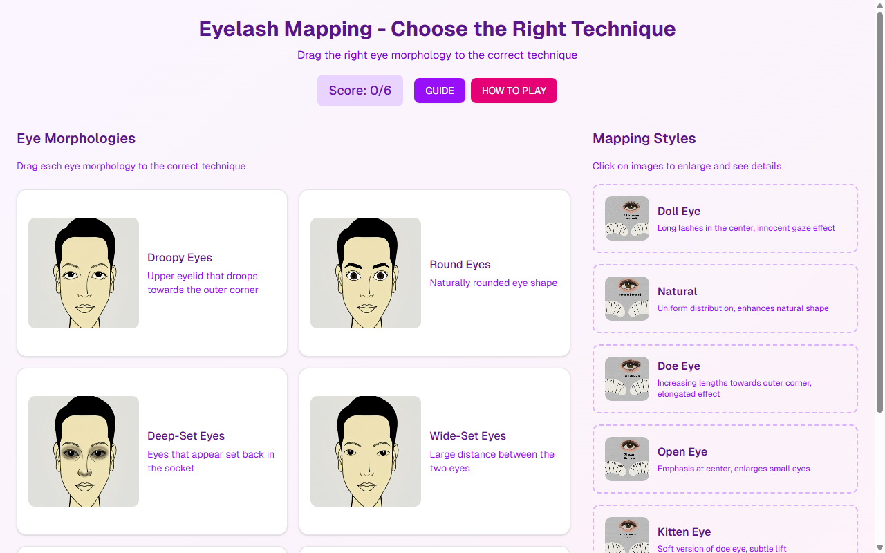

# Eyelash Mapping Game — Morphology & Technique

**Course:** Lash Extensions (EN)  
**Slide:** 5  
**Live URL:** https://adhjgc-qmn4.edtechiecorp.com  
**Stack:** Next.js · Tailwind CSS · TypeScript · GitHub Pages  

## What this slide does

An interactive eyelash mapping game that teaches learners how to assess eye morphology and select the correct lash extension style for each client. Learners practice matching lash lengths and curl types to different eye shapes, building the practical decision-making skills required before working on real clients. The game format reinforces technique knowledge through active recall.

## Screenshot

## Usage

This slide is embedded as an iframe inside Coassemble at the live URL above. DNS is managed via Cloudflare (`edtechiecorp.com`). To update the slide, push to the `main` branch — GitHub Actions will rebuild and redeploy automatically.
